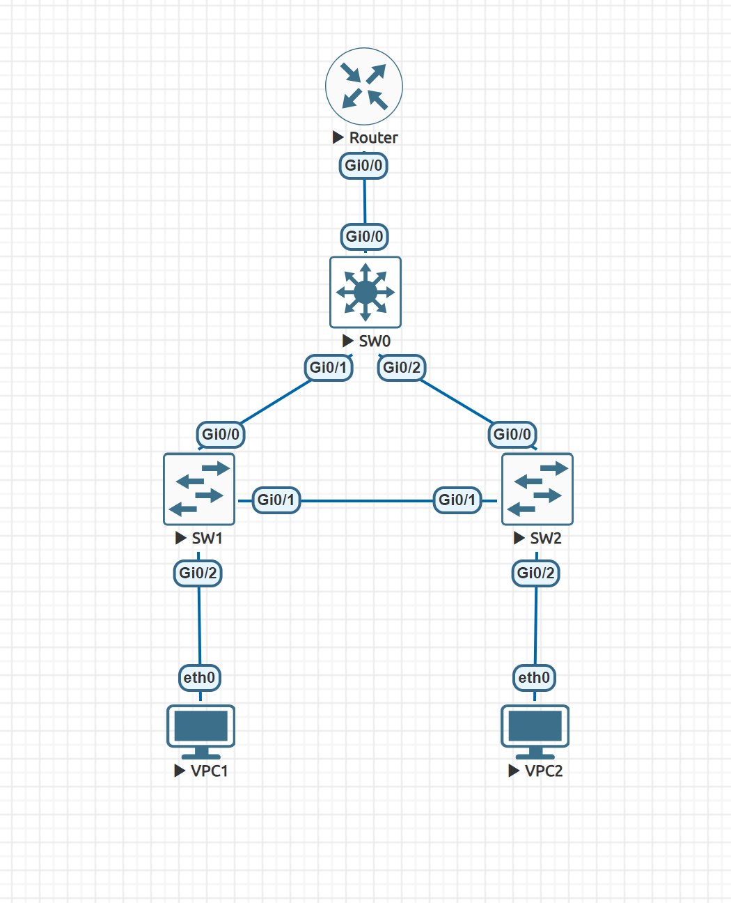

## Реализация небольшой сети офиса

### Схема



### Конфиги

- [Маршрутизатор](configs/router.txt)
- [Коммутатор (ядро сети)](configs/sw0.txt)
- [Коммутаторы доступа 1](configs/sw1.txt)
- [Коммутаторы доступа 2](configs/sw2.txt)
- [Клиент 1](configs/vpc1.txt)
- [Клиент 2](configs/vpc2.txt)

### Ping

Отправка PING с клиента 1 на клиент 2

```
VPCS> ping 10.0.20.1
84 bytes from 10.0.20.1 icmp_seq=1 ttl=255 time=14.949 ms
84 bytes from 10.0.20.1 icmp_seq=2 ttl=255 time=13.741 ms
84 bytes from 10.0.20.1 icmp_seq=3 ttl=255 time=36.283 ms
84 bytes from 10.0.20.1 icmp_seq=4 ttl=255 time=20.364 ms
84 bytes from 10.0.20.1 icmp_seq=5 ttl=255 time=25.038 ms
```

Отправка PING с клиента 2 на клиент 1

```
VPCS> ping 10.0.10.1
84 bytes from 10.0.10.1 icmp_seq=1 ttl=255 time=11.203 ms
84 bytes from 10.0.10.1 icmp_seq=2 ttl=255 time=9.325 ms
84 bytes from 10.0.10.1 icmp_seq=3 ttl=255 time=30.561 ms
84 bytes from 10.0.10.1 icmp_seq=4 ttl=255 time=26.304 ms
84 bytes from 10.0.10.1 icmp_seq=5 ttl=255 time=27.903 ms
```

### Протокол STP

1. Коммутатор уровня распределения является корнем сети для обоих VLAN

    Выведем адрес коммутатора уровня распределения

    ```
    Switch#show interfaces
    GigabitEthernet0/0 is up, line protocol is up (connected)
    Hardware is iGbE, address is 5000.0001.0000 (bia 5000.0001.0000)
    MTU 1500 bytes, BW 1000000 Kbit/sec, DLY 10 usec,
        reliability 255/255, txload 1/255, rxload 1/255
    ...
    ```

    Из spanning-tree коммутатора уровня распределения получим Root ID для VLAN 10 и VLAN 20

    ```
    VLAN0010
    Spanning tree enabled protocol ieee
    Root ID    Priority    10
                Address     5000.0001.0000
                This bridge is the root
                Hello Time   2 sec  Max Age 20 sec  Forward Delay 15 sec

    Bridge ID  Priority    10     (priority 0 sys-id-ext 10)
                Address     5000.0001.0000
                Hello Time   2 sec  Max Age 20 sec  Forward Delay 15 sec
                Aging Time  300 sec

    Interface           Role Sts Cost      Prio.Nbr Type
    ------------------- ---- --- --------- -------- --------------------------------
    Gi0/0               Desg FWD 4         128.1    P2p
    Gi0/1               Desg FWD 4         128.2    P2p
    Gi0/2               Desg FWD 4         128.3    P2p
    ```

    ```
    VLAN0020
    Spanning tree enabled protocol ieee
    Root ID    Priority    20
                Address     5000.0001.0000
                This bridge is the root
                Hello Time   2 sec  Max Age 20 sec  Forward Delay 15 sec

    Bridge ID  Priority    20     (priority 0 sys-id-ext 20)
                Address     5000.0001.0000
                Hello Time   2 sec  Max Age 20 sec  Forward Delay 15 sec
                Aging Time  300 sec

    Interface           Role Sts Cost      Prio.Nbr Type
    ------------------- ---- --- --------- -------- --------------------------------
    Gi0/0               Desg FWD 4         128.1    P2p
    Gi0/1               Desg FWD 4         128.2    P2p
    Gi0/2               Desg FWD 4         128.3    P2p
    ```

    Адрес корня для обоих VLAN совпадает с адресом коммутатора уровня распределения (```5000.0001.0000```)

2. Линк между коммутаторами уровня доступ должен стать заблокированным

    Это видно из spanning-tree коммутатора уровня доступа

    ```
    VLAN0001
    Spanning tree enabled protocol ieee
    Root ID    Priority    32769
                Address     5000.0005.0000
                This bridge is the root
                Hello Time   2 sec  Max Age 20 sec  Forward Delay 15 sec

    Bridge ID  Priority    32769  (priority 32768 sys-id-ext 1)
                Address     5000.0005.0000
                Hello Time   2 sec  Max Age 20 sec  Forward Delay 15 sec
                Aging Time  300 sec

    Interface           Role Sts Cost      Prio.Nbr Type
    ------------------- ---- --- --------- -------- --------------------------------
    Gi0/3               Desg FWD 4         128.4    P2p
    Gi1/0               Desg FWD 4         128.5    P2p
    Gi1/1               Desg FWD 4         128.6    P2p
    Gi1/2               Desg FWD 4         128.7    P2p
    Gi1/3               Desg FWD 4         128.8    P2p


    VLAN0010
    Spanning tree enabled protocol ieee
    Root ID    Priority    10
                Address     5000.0001.0000
                Cost        4
                Port        1 (GigabitEthernet0/0)
                Hello Time   2 sec  Max Age 20 sec  Forward Delay 15 sec

    Bridge ID  Priority    32778  (priority 32768 sys-id-ext 10)
                Address     5000.0005.0000
                Hello Time   2 sec  Max Age 20 sec  Forward Delay 15 sec
                Aging Time  300 sec

    Interface           Role Sts Cost      Prio.Nbr Type
    ------------------- ---- --- --------- -------- --------------------------------
    Gi0/0               Root FWD 4         128.1    P2p
    Gi0/1               Altn BLK 4         128.2    P2p
    Gi0/2               Desg FWD 4         128.3    P2p


    VLAN0020
    Spanning tree enabled protocol ieee
    Root ID    Priority    20
                Address     5000.0001.0000
                Cost        4
                Port        1 (GigabitEthernet0/0)
                Hello Time   2 sec  Max Age 20 sec  Forward Delay 15 sec

    Bridge ID  Priority    32788  (priority 32768 sys-id-ext 20)
                Address     5000.0005.0000
                Hello Time   2 sec  Max Age 20 sec  Forward Delay 15 sec
                Aging Time  300 sec

    Interface           Role Sts Cost      Prio.Nbr Type
    ------------------- ---- --- --------- -------- --------------------------------
    Gi0/0               Root FWD 4         128.1    P2p
    Gi0/1               Altn BLK 4         128.2    P2p

### Отказоустойчивость

Отключим интерфейс Gi0/2 на коммутаторе уровня распределения

```
Switch#conf
Switch(config)#int Gi0/2
Switch(config-if)#shutdown
```

Проверим, что интерфейс отключился

```
Port      Name               Status       Vlan       Duplex  Speed Type
Gi0/0                        connected    trunk      a-full   auto RJ45
Gi0/1                        connected    trunk      a-full   auto RJ45
Gi0/2                        disabled     1            auto   auto RJ45
Gi0/3                        connected    1          a-full   auto RJ45
Gi1/0                        connected    1          a-full   auto RJ45
Gi1/1                        connected    1          a-full   auto RJ45
Gi1/2                        connected    1          a-full   auto RJ45
Gi1/3                        connected    1          a-full   auto RJ45
```

Проверим связанность между клиентами

PING с клиента 1 на клиент 2

```
VPCS> ping 10.0.20.1
84 bytes from 10.0.20.1 icmp_seq=1 ttl=255 time=22.145 ms
84 bytes from 10.0.20.1 icmp_seq=2 ttl=255 time=27.042 ms
84 bytes from 10.0.20.1 icmp_seq=3 ttl=255 time=31.636 ms
84 bytes from 10.0.20.1 icmp_seq=4 ttl=255 time=21.068 ms
84 bytes from 10.0.20.1 icmp_seq=5 ttl=255 time=33.353 ms
```

PING с клиента 2 на клиент 1

```
VPCS> ping 10.0.10.1
84 bytes from 10.0.10.1 icmp_seq=1 ttl=255 time=17.338 ms
84 bytes from 10.0.10.1 icmp_seq=2 ttl=255 time=70.200 ms
84 bytes from 10.0.10.1 icmp_seq=3 ttl=255 time=33.553 ms
84 bytes from 10.0.10.1 icmp_seq=4 ttl=255 time=43.216 ms
84 bytes from 10.0.10.1 icmp_seq=5 ttl=255 time=40.150 ms
```
